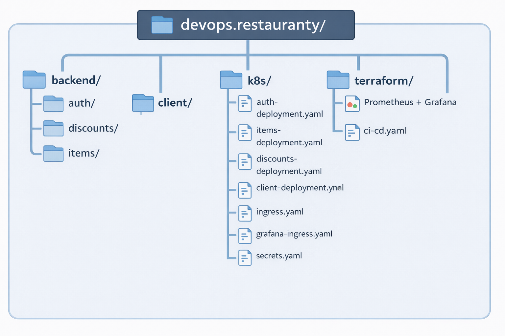

 my-version

 🍽️ Restauranty – Microservices DevOps Platform

Restauranty is a **microservices-based restaurant management platform** deployed on **Azure Kubernetes Service (AKS)** using modern DevOps practices including **Infrastructure as Code, CI/CD, monitoring, and secure HTTPS routing**.

This project demonstrates how to build and operate a **production-style cloud-native system**.

---

🚀 Live Demo

### Application

https://restauranty.shishir-pariyar.com

### Monitoring (Grafana)

https://grafana.shishir-pariyar.com

---

🏗️ Architecture Overview

---
🌐 Deployment URLs
Application
https://restauranty.shishir-pariyar.com

Grafana Monitoring
https://grafana.shishir-pariyar.com
—

 🧰 Tech Stack

## Infrastructure

- Terraform
- Azure Kubernetes Service (AKS)
- Azure Container Registry (ACR)
- Azure Load Balancer

## Containers

- Docker
- Docker Buildx (multi-arch images)

## Orchestration

- Kubernetes
- Deployments
- Services
- Ingress
- Secrets

## Networking

- Namecheap DNS
- NGINX Ingress Controller
- Let's Encrypt TLS (cert-manager)

## CI/CD

- GitHub Actions
- Docker build pipeline
- Automatic deployment to AKS

## Monitoring

- Prometheus
- Grafana
- Kubernetes metrics
- Application metrics

---

# 📁 Project Structure

---

# ⚙️ Local Development

### Start MongoDB

bash
docker run -d \
 --name my-mongo \
 -p 27017:27017 \
 -v mongo-data:/data/db \
 mongo:latest
Start Services
Open separate terminals.
Auth Service
cd backend/auth
npm install
npm start
Discounts Service
cd backend/discounts
npm install
npm start
Items Service
cd backend/items
npm install
npm start
Frontend
cd client
npm install
npm start

🐳 Docker
Each microservice is containerized using Docker.
Example:
docker build -t restauranty-auth ./backend/auth
Images are pushed to Azure Container Registry (ACR)
restaurantyacrshishir.azurecr.io

☸️ Kubernetes Deployment
Deploy all services:
kubectl apply -f k8s/
Check pods:
kubectl get pods
Check services:
kubectl get svc
Check ingress:
kubectl get ingress

🔐 HTTPS & TLS
TLS certificates are issued automatically using:
cert-manager
Let's Encrypt
Ingress handles secure routing for:
restauranty.shishir-pariyar.com
grafana.shishir-pariyar.com

🔄 CI/CD Pipeline
CI/CD is implemented with GitHub Actions.
Pipeline stages:
1️⃣ Install dependencies
2️⃣ Build Docker images
3️⃣ Push images to Azure Container Registry
4️⃣ Deploy to AKS
Location:
.github/workflows/ci-cd.yaml

📊 Monitoring
Monitoring stack deployed with:
Prometheus
Grafana
Metrics collected from:
Kubernetes nodes
Pods
Microservices
Application endpoints
Grafana dashboard:
https://grafana.shishir-pariyar.com

🔒 Security
Kubernetes Secrets for environment variables
HTTPS with TLS certificates
JWT authentication via Auth microservice
Single entry point using Ingress

📦 Infrastructure as Code
Infrastructure provisioned using:
Terraform
Resources created:
Resource Group
Azure Kubernetes Service
Azure Container Registry

👨‍💻 Author
Shishir Pariyar
DevOps Engineer | Cloud & Kubernetes Enthusiast

⭐ Project Goals
This project demonstrates:
Microservices architecture
Kubernetes orchestration
Infrastructure as Code
CI/CD automation
Monitoring & observability
Secure production deployment

📜 License
This project is for educational and portfolio purposes.

---

