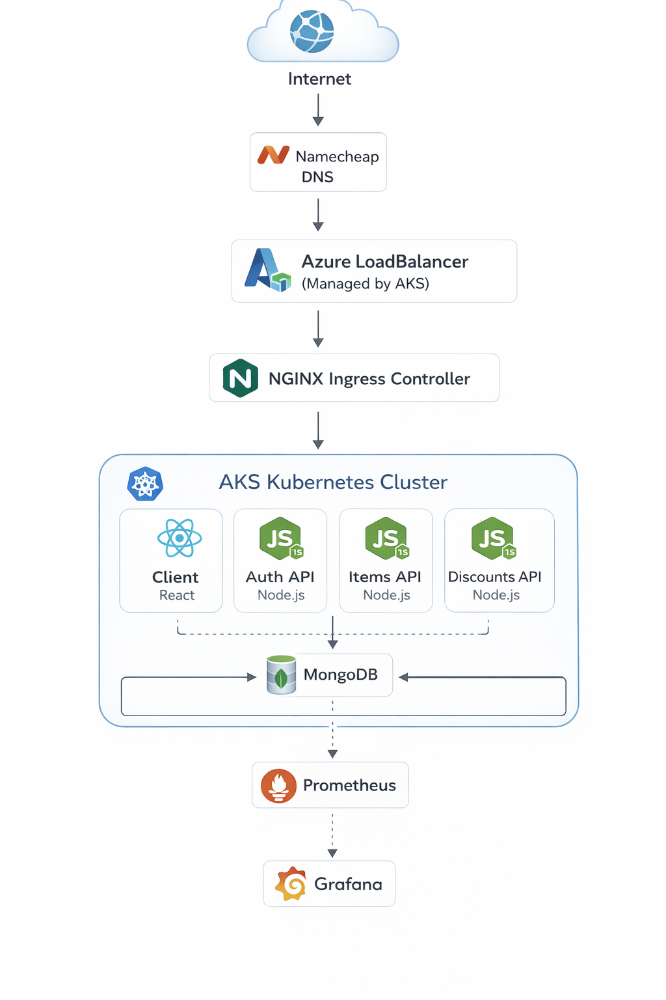

 my-version

 🍽️ Restauranty – Microservices DevOps Platform

Restauranty is a **microservices-based restaurant management platform** deployed on **Azure Kubernetes Service (AKS)** using modern DevOps practices including **Infrastructure as Code, CI/CD, monitoring, and secure HTTPS routing**.

This project demonstrates how to build and operate a **production-style cloud-native system**.

---

🚀 Live Demo

### Application

https://restauranty.shishir-pariyar.com

### Monitoring (Grafana)

https://grafana.shishir-pariyar.com

---

🏗️ Architecture Overview



---
🌐 Deployment URLs
Application
https://restauranty.shishir-pariyar.com
Grafana Monitoring
https://grafana.shishir-pariyar.com
—

 🧰 Tech Stack

## Infrastructure

- Terraform
- Azure Kubernetes Service (AKS)
- Azure Container Registry (ACR)
- Azure Load Balancer

## Containers

- Docker
- Docker Buildx (multi-arch images)

## Orchestration

- Kubernetes
- Deployments
- Services
- Ingress
- Secrets

## Networking

- Namecheap DNS
- NGINX Ingress Controller
- Let's Encrypt TLS (cert-manager)

## CI/CD

- GitHub Actions
- Docker build pipeline
- Automatic deployment to AKS

## Monitoring

- Prometheus
- Grafana
- Kubernetes metrics
- Application metrics

---

# 📁 Project Structure
devops.restauranty/
├── backend/
│ ├── auth/
│ ├── discounts/
│ └── items/
│
├── client/
│
├── k8s/
│ ├── auth-deployment.yaml
│ ├── items-deployment.yaml
│ ├── discounts-deployment.yaml
│ ├── client-deployment.yaml
│ ├── ingress.yaml
│ ├── grafana-ingress.yaml
│ └── secrets.yaml
│
├── terraform/
│
├── monitoring/
│ └── Prometheus + Grafana
│
└── .github/workflows/
└── ci-cd.yaml

---

# ⚙️ Local Development

### Start MongoDB

bash
docker run -d \
 --name my-mongo \
 -p 27017:27017 \
 -v mongo-data:/data/db \
 mongo:latest
Start Services
Open separate terminals.
Auth Service
cd backend/auth
npm install
npm start
Discounts Service
cd backend/discounts
npm install
npm start
Items Service
cd backend/items
npm install
npm start
Frontend
cd client
npm install
npm start

🐳 Docker
Each microservice is containerized using Docker.
Example:
docker build -t restauranty-auth ./backend/auth
Images are pushed to Azure Container Registry (ACR)
restaurantyacrshishir.azurecr.io

☸️ Kubernetes Deployment
Deploy all services:
kubectl apply -f k8s/
Check pods:
kubectl get pods
Check services:
kubectl get svc
Check ingress:
kubectl get ingress

🔐 HTTPS & TLS
TLS certificates are issued automatically using:
cert-manager
Let's Encrypt
Ingress handles secure routing for:
restauranty.shishir-pariyar.com
grafana.shishir-pariyar.com

🔄 CI/CD Pipeline
CI/CD is implemented with GitHub Actions.
Pipeline stages:
1️⃣ Install dependencies
2️⃣ Build Docker images
3️⃣ Push images to Azure Container Registry
4️⃣ Deploy to AKS
Location:
.github/workflows/ci-cd.yaml

📊 Monitoring
Monitoring stack deployed with:
Prometheus
Grafana
Metrics collected from:
Kubernetes nodes
Pods
Microservices
Application endpoints
Grafana dashboard:
https://grafana.shishir-pariyar.com

🔒 Security
Kubernetes Secrets for environment variables
HTTPS with TLS certificates
JWT authentication via Auth microservice
Single entry point using Ingress

📦 Infrastructure as Code
Infrastructure provisioned using:
Terraform
Resources created:
Resource Group
Azure Kubernetes Service
Azure Container Registry

👨‍💻 Author
Shishir Pariyar
DevOps Engineer | Cloud & Kubernetes Enthusiast

⭐ Project Goals
This project demonstrates:
Microservices architecture
Kubernetes orchestration
Infrastructure as Code
CI/CD automation
Monitoring & observability
Secure production deployment

📜 License
This project is for educational and portfolio purposes.

---

# Restauranty

A restaurant management platform built with a **microservices architecture**: 3 Node.js/Express backends + a React frontend, unified behind HAProxy path-based routing.

## Architecture

                         ┌────────────────────────┐
                         │   HAProxy / Ingress    │
    Browser ───────────► │       (port 80)        │
                         └───────────┬────────────┘
                                     │
            ┌────────────────────────┼─────────────────────────┐
            │                        │                         │
       /api/auth/*             /api/items/*             /api/discounts/*
            │                        │                         │
   ┌────────▼────────┐     ┌─────────▼─────────┐    ┌─────────▼──────────┐
   │  Auth Service   │     │  Items Service    │    │ Discounts Service  │
   │   (port 3001)   │     │   (port 3003)     │    │   (port 3002)      │
   └────────┬────────┘     └─────────┬─────────┘    └──────────┬─────────┘
            │                        │                         │
            └────────────────────────┼─────────────────────────┘
                                     │
                              ┌──────▼──────┐
                              │   MongoDB   │
                              │ (port 27017)│
                              └─────────────┘

## Microservices

| Service | Port | Path | Responsibilities |
|---------|------|------|-----------------|
| **Auth** | 3001 | `/api/auth/*` | User signup, login, JWT authentication |
| **Discounts** | 3002 | `/api/discounts/*` | Coupon and campaign management |
| **Items** | 3003 | `/api/items/*` | Menu items, dietary categories, orders |
| **Frontend** | 3000 | `/` | React SPA (admin dashboard) |

## Quick Start

### 1. Start MongoDB
bash
docker run -d \
  --name my-mongo \
  -p 27017:27017 \
  -v mongo-data:/data/db \
  mongo:latest
```

### 2. Start each microservice

```bash
# Terminal 1 - Auth
cd backend/auth && npm install && npm start

# Terminal 2 - Discounts
cd backend/discounts && npm install && npm start

# Terminal 3 - Items
cd backend/items && npm install && npm start

# Terminal 4 - Frontend
cd client && npm install && npm start


### 3. Start HAProxy

bash
haproxy -f haproxy.cfg


Access the app at **http://localhost/**

## Environment Variables

Each microservice uses the same set of environment variables (see `.env.example` in each service folder):

| Variable | Description | Example |
|----------|-------------|---------|
| `SECRET` | JWT signing key | `MySecret1!` |
| `MONGODB_URI` | MongoDB connection string | `mongodb://127.0.0.1:27017/restauranty` |
| `CLOUD_NAME` | Cloudinary cloud name | _(ask instructor)_ |
| `CLOUD_API_KEY` | Cloudinary API key | _(ask instructor)_ |
| `CLOUD_API_SECRET` | Cloudinary API secret | _(ask instructor)_ |
| `PORT` | Service port | `3001` / `3002` / `3003` |

For the frontend, use the `REACT_APP_` prefix: `REACT_APP_API_URL=http://localhost:80`

## Tech Stack

- **Frontend**: React 18, React Router 6, Tailwind CSS, Axios, React Icons
- **Backend**: Express, Mongoose, JWT (jsonwebtoken + express-jwt), bcryptjs
- **Image Storage**: Cloudinary (via multer-storage-cloudinary)
- **Monitoring**: Prometheus metrics (`/metrics` endpoint on each backend service)
- **Routing**: HAProxy (local) / Kubernetes Ingress (production)
- **Database**: MongoDB
main
